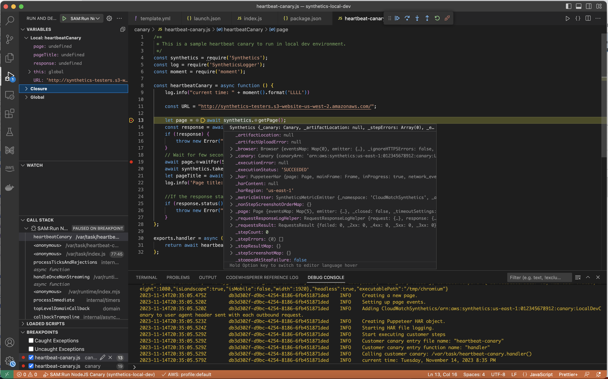
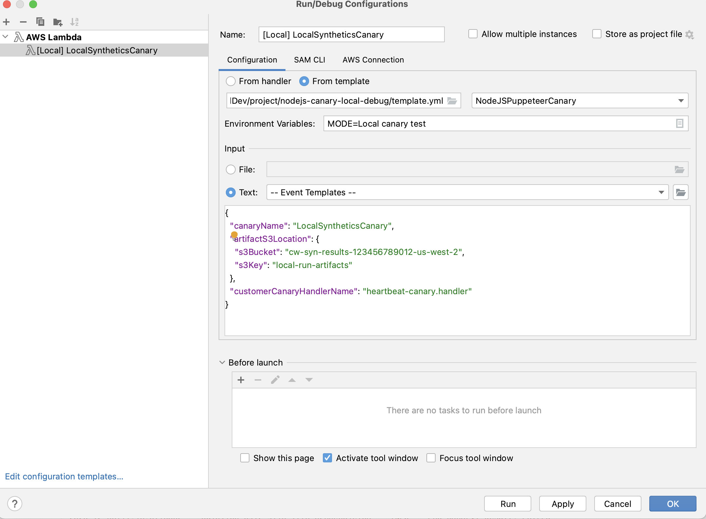

## Testing and debugging Amazon CloudWatch Synthetics canary locally

This repository contains code examples and related resources showing you how to run, test and debug Synthetics Canary locally on your computer.


## Overview

The local testing environment uses Serverless Application Model (SAM), to simulate a AWS Lambda function in a local Docker container to emulate the behavior of a Synthetics canary.

## Pre-requisites
You should have the following prerequisites: 
- An [Amazon S3](https://aws.amazon.com/s3/) bucket for canary artifacts.
    - **Note**: Choose or create an Amazon S3 bucket to use to store artifacts from local canary test runs, such as HAR files and screenshots. This requires you to be provisioned with IAM. If you skip setting up Amazon S3 buckets you can still test your canary locally, but you will see an error message about the missing bucket and you won't have access to canary artifacts. 
     
      If you use an Amazon S3 bucket, we recommend that you set the bucket lifecycle to delete objects after a few days. For more information, see [Managing your storage lifecycle](https://docs.aws.amazon.com/AmazonS3/latest/userguide/object-lifecycle-mgmt.html).
-	Set up [default AWS profile](https://docs.aws.amazon.com/cli/latest/userguide/cli-configure-files.html) for the AWS account.
-	Set the debug environment's default AWS Region to your preferred Region, such as `us-west-2`.
-	Latest version of [AWS Serverless Application Model](https://docs.aws.amazon.com/serverless-application-model/latest/developerguide/install-sam-cli.html) (SAM) CLI installed.
-   Install the [AWS SAM CLI](https://docs.aws.amazon.com/serverless-application-model/latest/developerguide/install-sam-cli.html).
-	Install [Visual Studio Code](https://code.visualstudio.com/) IDE or [JetBrains IDE](https://www.jetbrains.com/idea/). 
-	Install [Docker](https://docs.docker.com/get-docker/). Make sure to start the docker daemon.       
-	Install [AWS Toolkit extension](https://docs.aws.amazon.com/toolkit-for-vscode/latest/userguide/welcome.html) for VS Code or [AWS Toolkit for IntelliJ IDEA](https://docs.aws.amazon.com/toolkit-for-vscode/latest/userguide/welcome.html) extension for JetBrains IDE depending on your editor preference.

## Setting up local testing environment
Clone this repository using this cmd.
```
git clone https://github.com/aws-samples/synthetics-canary-local-debugging-sample.git
```

The repository contains code samples for both NodeJS canary and Python canary. 

### NodeJS canary
1.	Go inside NodeJS canary source directory. 
    ```
    cd synthetics-canary-local-debugging-sample/nodejs-canary/src
    ```
2.	Run `npm install` to install canary dependencies.

### Python canary
1.	Go inside Python canary source directory. 
    ```
    cd synthetics-canary-local-debugging-sample/python-canary/src
    ``` 
2.	Run `pip3 install -r requirements.txt -t .` to install canary dependencies.

## Visual Studio Code launch configuration
The launch configuration file is located at `.vscode/launch.json`. It contains configuration to allow the template file to be discovered by VS Code. It defines Lambda payload with required parameters to invoke the canary successfully. Here’s the launch configuration for NodeJS canary.

```
{
            ...
            ...
            "lambda": {
                "payload": {
                    "json": {
                        // Canary name. Provide any name you like.
                        "canaryName": "LocalSyntheticsCanary", 
                        // Canary artifact location
                        "artifactS3Location": {
                            "s3Bucket": "cw-syn-results-123456789012-us-west-2",
                            "s3Key": "local-run-artifacts",
                        },
                        // Your canary handler name
                        "customerCanaryHandlerName": "heartbeat-canary.handler",
                        // Canary run Id
                        "canaryRunId": "random-uuid"
                    }
                },
                // Environment variables to pass to the canary code
                "environmentVariables": {}
            }
        }
    ]
}

```
Other optional fields that you can provide in payload JSON are:               
- `s3EncryptionMode`: valid values: `SSE_S3` | `SSE_KMS`.
- `s3KmsKeyArn`: <KMS Key ARN>
- `activeTracing`: valid values: true | false.         

## Debugging canary in VS Code
Add breakpoints in the canary code where you wish to pause execution by clicking on the editor margin and go to **Run and Debug** mode in the editor. Execute the canary by clicking on the play button. When the canary executes, the logs will be tailed in the debug console, providing you with real-time insights into the canary's behavior. If you added breakpoints the canary execution will pause at each breakpoint, allowing you step through code and inspect variable values, instance methods, object attributes, function call stack etc.

There is no cost incurred for running and debugging canary locally except for the artifacts stored in S3 bucket and the CloudWatch metrics generated by each local run.




## Debugging canary in JetBrains IDE
If you use [JetBrains IDE](https://www.jetbrains.com/idea/) then you will require [AWS Toolkit for IntelliJ IDEA](https://aws.amazon.com/intellij/) extension is installed and bundled **Node.js** plugin and **JavaScript Debugge**r are enabled to run and debug canary (required for NodeJS canary). Once you have the extension installed follow these steps.

1. Create **Run/Debug** configuration by choosing AWS Lambda -> Local configuration template. 
2. Provide a name for the run configuration eg: [Local] LocalSyntheticsCanary. 
3. Select **From template** option, click on the file browser in the template field and select the `template.yml` file from the project (either from nodejs directory or python directory).
4. Under input section, provide the payload for the canary as shown below. Other optional fields are listed in **VS Code launch configuration** section.
```
{
    "canaryName": "LocalSyntheticsCanary",
    "artifactS3Location": {
        "s3Bucket": "cw-syn-results-123456789012-us-west-2",
        "s3Key": "local-run-artifacts"
    },
    "customerCanaryHandlerName": "heartbeat-canary.handler",
    "canaryRunId": "random-uuid"
}
```




## Run canary locally with SAM CLI
1. Make sure to specify your own S3 bucket name for `s3Bucket` in `event.json`.
2. To run NodeJS canary, go to `nodejs-canary` directory and run following commands.
    - `sam build`
    - `sam local invoke -e NodeJSPuppeteerCanary ../event.json` (To run Puppeteer canary)
    - `sam local invoke -e NodeJSPlaywrightCanary ../event.json` (To run Playwright canary)
3. Similary to run Python canary, go to `python-canary` directory and run same commands as above.

## Caveat

Debugging visual monitoring canaries poses a challenge due to the reliance on base screenshots captured during the initial run for subsequent comparisons. In a local development environment, runs are neither stored nor tracked, treating each iteration as an independent, standalone run. Consequently, the absence of a run history makes it impractical to perform debugging for canaries relying on visual monitoring.

## Integrating local debugging environment into existing canary package

You can quickly integrate local canary debugging into your existing canary package by copying following three files:
1.	Copy the `template.yml` file into your canary package root. Be sure to modify the path for `CodeUri` to point to the directory where your canary code exists.
2.	If you're working with a Node.js canary, copy the `cw-synthetics.js` file to your canary source directory. If you're working with a Python canary, copy the `cw-synthetics.py` to your canary source directory.
3.	Put launch configuration file `.vscode/launch.json` in the package root. Make sure to put it inside `.vscode` directory; create it if it does not exist already.


## Common errors

1. Error: Running AWS SAM projects locally requires Docker. Have you got it installed and running?

    Make sure to start docker on your computer.

2. SAM local invoke failed: An error occurred (ExpiredTokenException) when calling the GetLayerVersion operation: The security token included in the request is expired

    Make sure AWS default profile is set up.
    
## More common errors

For more information about common errors with the SAM, see [AWS SAM CLI troubleshooting](https://docs.aws.amazon.com/serverless-application-model/latest/developerguide/sam-cli-troubleshooting.html).


## Synthetics Lambda layers for runtimes 
The Lambda layer ARN for Synthetics runtimes are listed in [AWS documentation](https://docs.aws.amazon.com/AmazonCloudWatch/latest/monitoring/CloudWatch_Synthetics_Debug_Locally.html#CloudWatch_Synthetics_Debug_DifferentRuntime)


## License
This project is licensed under the MIT-0 License. See the LICENSE file.